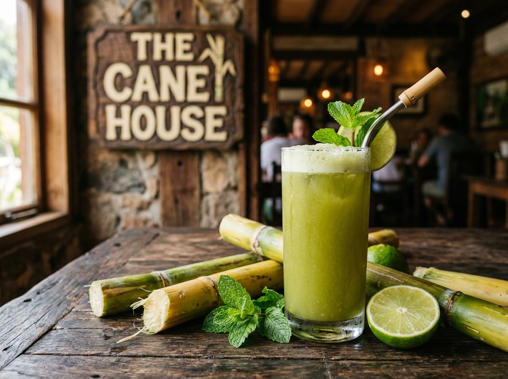

# VINTAGE DESIGN SYSTEM RULES & ARCHITECTURE SPECIFICATION
> **Theme:** `vintageSoulTheme`  
> **Status:** 100% COMPLETE & VERIFIED (All 9 Routes Operational, 0 PHP Errors, 0 Layout Breaks)  
> **Design Philosophy:** 19th-Century London Botanical Cold-Press Heritage — Warm Parchment, Dark Forest Green, Honey Gold, Layer-Isolated Deckle Rough Cuts, and Regal Typography.

---

## Table of Contents
1. [Core Design Philosophy](#1-core-design-philosophy)
2. [Master Color Palette & Tokens](#2-master-color-palette--tokens)
3. [Typography Hierarchy & Readability Rules](#3-typography-hierarchy--readability-rules)
4. [The Deckle Rough-Cut Filter Architecture](#4-the-deckle-rough-cut-filter-architecture)
5. [Complete Catalog of Styled Components](#5-complete-catalog-of-styled-components)
6. [Layout, Carousels & Responsive Grids](#6-layout-carousels--responsive-grids)
7. [Special Cinematic Features](#7-special-cinematic-features)
8. [Developer Cheatsheet & Copy-Paste Boilerplates](#8-developer-cheatsheet--copy-paste-boilerplates)

---

## 1. Core Design Philosophy
The Cane House vintage theme marries authentic 19th-century British botanical heritage with the organic warmth of fresh-pressed raw sugarcane juice.
* **Warm Parchment & Handcrafted Paper:** Warm stained parchment backgrounds layered with subtle fiber and grain textures.
* **Organic Deckle Rough Cuts:** Tactile, hand-torn deckle paper edges across buttons, cards, ribbons, and photo frames.
* **Layered Gold & Roasted Bark Framing:** Double-layer borders combining deep roasted bark outlines (`#8e622d`) with delicate inner gold hairlines (`#caa06d`).
* **100% Crisp & Legible Typography:** Zero visual distortion on text characters, achieving maximum legibility while preserving vintage styling.
* **Complete Component Parity:** Audited and verified across all buttons, cards, badges, ribbons, inputs, social streams, and page templates.

---

## 2. Master Color Palette & Tokens
All CSS variables are defined in [`assets/css/variables.css`](file:///e:/MY-GITHUB/AR01H/projects/wordpress_design/cms-project/themes/vintageSoulTheme/assets/css/variables.css).

```css
:root {
  /* ═══ Heritage Botanical Greens ═══ */
  --vintage-green-dark:   #11381b; /* Primary button base, dark forest panels */
  --vintage-green-mid:    #1b542a; /* Card header accents, botanical gradients */
  --vintage-green-deep:   #091f0f; /* Deep shadow tones, dark backgrounds */
  --vintage-green-glow:   #2e7d32; /* Radiant hover aura */

  /* ═══ Roasted Bark & Wood Tones ═══ */
  --vintage-bark-dark:    #2b1406; /* Primary heading text, dark frames */
  --vintage-bark-border:  #8e622d; /* Primary 1.5px outer border rule */
  --vintage-bark-subtle:  #7d582c; /* Subtitle descriptions, secondary borders */
  --vintage-amber-brown:  #8e5222; /* Section header <em> emphasis color */

  /* ═══ Warm Honey & Gold Accents ═══ */
  --vintage-gold-bright:  #f6d599; /* Radiant text highlights, button hover glows */
  --vintage-gold-inner:   #caa06d; /* Standard 1px / 1.5px inner hairline rule */
  --vintage-gold-accent:  #d49842; /* Wax seals, badge outlines, icon strokes */

  /* ═══ Aged Parchment Layering ═══ */
  --vintage-parchment-light: #fbf2e6; /* Light card background, lead paragraphs */
  --vintage-parchment-mid:   #f4e4cd; /* Standard section parchment background */
  --vintage-parchment-deep:  #dfbe88; /* Shadowed parchment gradients */
  --vintage-parchment-aged:  #edd5ad; /* Canvas base color */
}
```

---

## 3. Typography Hierarchy & Readability Rules

### Font Families
| Role | Font Family | Fallbacks | Usage |
| :--- | :--- | :--- | :--- |
| **Headings & Badges** | `'Cinzel'` | `'Playfair Display', serif` | Section titles, buttons, tags, card titles |
| **Editorial Titles** | `'Playfair Display'` | `Georgia, serif` | Section title `<em>` emphasis, hero subheadings |
| **Vintage Cursive** | `'Dancing Script'` | `'Cormorant Garamond', cursive` | Section eyebrows, handwritten signatures |
| **Body & Long Form** | `'EB Garamond'` | `Georgia, serif` | Paragraphs, lead stories, FAQs, descriptions |
| **Display / Stamp** | `'Rubik Dirt'` | `'Cinzel', cursive` | Archival gallery tags, stamp badges |

### Critical Typography Readability Rule
> [!IMPORTANT]
> **NEVER apply displacement filters (`filter: url(#rough-...)`) directly to text elements or containers where text isn't isolated.**
> Always enforce the following global protection rule across all text nodes:

```css
p, h1, h2, h3, h4, h5, h6, span, a, label, input, textarea, select, button,
.card__title, .card__body, .section-eyebrow, .faq-accordion__question {
  filter: none !important;
  -webkit-filter: none !important;
  text-rendering: optimizeLegibility !important;
  -webkit-font-smoothing: antialiased !important;
  -moz-osx-font-smoothing: grayscale !important;
}
```

### Section Header `<em>` Emphasis Rule
In all section headings (`<h2>`, `<h3>`), highlight words with `<em>` tags to render in warm heritage brown:
```css
.section-header__title em,
.section-title em,
h2 em,
h3 em {
  color: #8e5222 !important; /* Rich Vintage Warm Amber-Brown */
  font-family: 'Playfair Display', 'EB Garamond', serif !important;
  font-style: italic !important;
  font-weight: 700 !important;
  text-transform: none !important;
  text-shadow: 0 1px 0 rgba(255, 248, 235, 0.7) !important;
  padding: 0 2px !important;
}
```

---

## 4. The Deckle Rough-Cut Filter Architecture

### SVG Displacement Filter Definitions
In [`header.php`](file:///e:/MY-GITHUB/AR01H/projects/wordpress_design/cms-project/themes/vintageSoulTheme/header.php):
```html
<svg style="position: absolute; width: 0; height: 0; overflow: hidden; pointer-events: none;" aria-hidden="true">
  <defs>
    <!-- Standard Deckle Rough Cut -->
    <filter id="rough-button-cut" x="-10%" y="-10%" width="120%" height="120%">
      <feTurbulence type="fractalNoise" baseFrequency="0.045 0.045" numOctaves="3" seed="33" result="noise"/>
      <feDisplacementMap in="SourceGraphic" in2="noise" scale="3" xChannelSelector="R" yChannelSelector="G"/>
    </filter>
    <!-- Subtle Deckle Rough Cut (Recommended for cards, pills & buttons) -->
    <filter id="rough-button-cut-sm" x="-10%" y="-10%" width="120%" height="120%">
      <feTurbulence type="fractalNoise" baseFrequency="0.06 0.06" numOctaves="3" seed="18" result="noise"/>
      <feDisplacementMap in="SourceGraphic" in2="noise" scale="2" xChannelSelector="R" yChannelSelector="G"/>
    </filter>
  </defs>
</svg>
```

### The Layer-Isolated Implementation Pattern
To apply rough-cut borders to any container **without distorting child text**:
1. Set the container to `position: relative; z-index: 1; background: transparent; border: none;`.
2. Move the background, border, shadow, and displacement filter to the `::before` pseudo-element with `z-index: -1; pointer-events: none;`.
3. Set child text elements to `position: relative; z-index: 2; filter: none !important;`.

```css
/* Container */
.my-vintage-card {
  position: relative !important;
  z-index: 1 !important;
  background: transparent !important;
  border: none !important;
  padding: 16px 20px !important;
}

/* Background & Rough Cut Border Layer */
.my-vintage-card::before {
  content: "" !important;
  position: absolute !important;
  inset: 0 !important;
  background: linear-gradient(135deg, #fcf7ef 0%, #f4e4cd 100%) !important;
  border: 1.5px solid #8e622d !important;
  border-radius: 6px !important;
  box-shadow:
    inset 0 0 0 1px #caa06d,
    0 6px 18px rgba(42, 26, 12, 0.14) !important;
  filter: url(#rough-button-cut-sm) !important;
  -webkit-filter: url(#rough-button-cut-sm) !important;
  z-index: -1 !important;
  pointer-events: none !important;
  transition: all 0.25s ease !important;
}

/* Hover State */
.my-vintage-card:hover::before {
  border-color: #f6d599 !important;
  box-shadow:
    inset 0 0 0 1px #f6d599,
    0 10px 26px rgba(42, 26, 12, 0.22) !important;
  transform: translateY(-2px) !important;
}

/* Sharp Text Children */
.my-vintage-card > * {
  position: relative !important;
  z-index: 2 !important;
  filter: none !important;
  -webkit-filter: none !important;
  text-rendering: optimizeLegibility !important;
  -webkit-font-smoothing: antialiased !important;
}
```

---

## 5. Complete Catalog of Styled Components

### 1. Master Buttons ([`button.css`](file:///e:/MY-GITHUB/AR01H/projects/wordpress_design/cms-project/themes/vintageSoulTheme/assets/css/components/button.css), [`header.css`](file:///e:/MY-GITHUB/AR01H/projects/wordpress_design/cms-project/themes/vintageSoulTheme/assets/css/components/header.css), [`home.css`](file:///e:/MY-GITHUB/AR01H/projects/wordpress_design/cms-project/themes/vintageSoulTheme/assets/css/pages/home.css))
* **Primary Button (`.btn--primary-vintage`, `.btn--primary`):** Botanical green gradient (`#11381b` -> `#0d2f16`), gold serif text (`#f6d599`), rough cut border layer (`#8e622d`).
* **Secondary Button (`.btn--secondary-vintage`, `.btn--outline-vintage`):** Roasted dark bark gradient (`#2b1406` -> `#1e0c03`), cream text (`#fbf2e6`), rough cut border layer.
* **Header CTA Button (`.header-cta-button`):** Layer-isolated deckle rough cut on `::before` (`filter: url(#rough-button-cut-sm)`) with double gold/bark borders and crisp typography on `z-index: 2`.
* **Floating Section Quick Navigation (`.vintage-section-nav__btn`, `.vintage-section-nav__tooltip`):** Circular navigation pills and floating tooltips with layer-isolated deckle roughness and gold hairline borders.
* **Header Menu Navigation Links (`.nav__link`):** Layer-isolated deckle parchment hover pill with gold hairline borders.
* **Order Now Action Button (`.btn--order-now`):** Compact action button with rough cut borders for quick shop/order prompts.

### 2. Eyebrow Tags & Swallowtail Ribbons ([`home.css`](file:///e:/MY-GITHUB/AR01H/projects/wordpress_design/cms-project/themes/vintageSoulTheme/assets/css/pages/home.css), [`section-header.css`](file:///e:/MY-GITHUB/AR01H/projects/wordpress_design/cms-project/themes/vintageSoulTheme/assets/css/components/section-header.css))
* **`.vintage-ribbon-tag`:** Roasted bark center capsule with swallowtail wings (`::before` / `::after`), double gold hairlines, and 100% crisp typography on `span` (`z-index: 3`).
* **`.vintage-ribbon-tag--gold`:** Deep botanical green variation for dark or highlighted sections.
* **`.logo-strip-vintage` (As Featured & Trusted By):** Dedicated centered ribbon header with infinite scrolling partner badges including London Sutton Market, Soil Association Organic, Food Hygiene 5★, BBC Good Food, Time Out London, Borough Market, Slow Food UK, and The Grocer.
* **`.section-header__tag`:** Tag with dual gold hairline gradient wings.

### 3. Cards Across All Pages ([`card.css`](file:///e:/MY-GITHUB/AR01H/projects/wordpress_design/cms-project/themes/vintageSoulTheme/assets/css/components/card.css))
* **Home Page:** `.card`, `.frame--rough-cut`, `.intro-highlight-item`, `.drink-row-card`, `.feature-box-vintage`, `.craft-story-card`.
* **About Us (`/about`):** `.about-hero__card`, `.about-story-card`, `.cane-pillar-card`, `.process-step-card`.
* **Contact & Events (`/contact`):** `.contact-card`, `.contact-form-card`, `.booking-wizard-card`, `.booking-form-card`, `.contact-info-card`, `.contact-home-event-badge`, `.social-pill`.
* **All About Cane & History (`/history`):** `.history-timeline__card`, `.memory-card`, `.faq-accordion__item`.

### 4. Dual-Direction Infinite Social Media Stream ([`social-stream-section.php`](file:///e:/MY-GITHUB/AR01H/projects/wordpress_design/cms-project/themes/vintageSoulTheme/components/sections/social-stream-section.php), [`home.css`](file:///e:/MY-GITHUB/AR01H/projects/wordpress_design/cms-project/themes/vintageSoulTheme/assets/css/pages/home.css))
* **Row 1 (Right-to-Left Infinite Loop):** Seamless infinite ticker stream for Instagram Reels, TikToks, and customer tasting reactions.
* **Row 2 (Left-to-Right Opposite Infinite Loop):** Seamless infinite ticker stream for YouTube Shorts, live festival stalls, and behind-the-scenes milling footage.
* **Deckle Rough Cut Cards (`.social-card`):** 250px vertical cards with isolated `::before` deckle paper cuts, double gold borders, platform badges (`IG Reel`, `YouTube Short`, `TikTok`), play icons, handles, captions, and like/comment stats.
* **Pause on Hover:** Auto-pauses animation on mouseover for effortless reading and clicking.
* **Follow Action Bar:** Rough-cut vintage buttons to follow on Instagram, YouTube, and WhatsApp VIP club.

### 5. Marquees & Tickers ([`marquee.css`](file:///e:/MY-GITHUB/AR01H/projects/wordpress_design/cms-project/themes/vintageSoulTheme/assets/css/components/marquee.css))
* **`.ribbon-ticker--green`:** Pre-header and pre-footer infinite ticker with rough-cut edges and razor-sharp gold text.
* **`.ribbon-ticker--dark`:** Roasted bark ticker for mid-page transitions.

---

## 6. Layout, Carousels & Responsive Grids

### Single-Row Carousel Grid Pattern
Gallery cards (`.events-gallery-grid`, `.franchise-gallery-grid`, `.order-gallery-grid`) are structured for clean 1-row layout:
```css
/* Desktop: 4 Cards in 1 Row */
.events-gallery-grid,
.franchise-gallery-grid,
.order-gallery-grid {
  display: grid;
  grid-template-columns: repeat(4, 1fr);
  gap: 14px;
  margin-bottom: 24px;
}

/* Tablet & Mobile: Smooth Horizontal Scroll-Snap Row */
@media (max-width: 991px) {
  .events-gallery-grid,
  .franchise-gallery-grid,
  .order-gallery-grid {
    display: flex;
    overflow-x: auto;
    scroll-snap-type: x mandatory;
    -webkit-overflow-scrolling: touch;
    gap: 12px;
    padding-bottom: 10px;
    scrollbar-width: thin;
  }
  .event-gallery-card,
  .franchise-gallery-card,
  .order-gallery-card {
    flex: 0 0 220px;
    scroll-snap-align: start;
  }
}
```

---

## 7. Special Cinematic Features

### 1. Cinematic Sugarcane Plantation Forest Gates Preloader ([`loader.php`](file:///e:/MY-GITHUB/AR01H/projects/wordpress_design/cms-project/themes/vintageSoulTheme/components/loader/loader.php), [`loader.json`](file:///e:/MY-GITHUB/AR01H/projects/wordpress_design/cms-project/themes/vintageSoulTheme/data/content/loader.json))
* **Home Page Exclusive (`is_front_page()` / `is_home()`):** The cinematic double-door entrance loader executes strictly on the Home page entry, keeping inner pages fast and direct.
* **JSON-Driven Architecture:** All strings (seal text, status label, tagline) and asset paths (logo icon, riveted wood texture, sugarcane grove engraving) are loaded dynamically from `data/content/loader.json` via `JsonFileProvider::read()`.
* **Pure Sugarcane Forest Trees Inlay:** Grand double wooden doors with rich riveted wood planks (`wooden-plank-riveted.png`) and a continuous panoramic 19th-century botanical engraving of a **pure dense sugarcane grove** (`pure_sugarcane_forest_trees_engraving.jpg`) featuring exclusively tall standing sugarcane trees, lush leafy canopies, segmented bamboo joints, and warm sunlight with zero people, buildings, or carts.
* **Enlarged Prominent Emblem Crest:** Large 140px Cane House logo icon (`logo.png`) centered inside an expanded botanical green & gold frame with pulsating golden aura, glowing gold seal, and botanical progress bar.
* **Direct Website Revelation:** When the doors swing open in 3D perspective (`rotateY(-24deg)` / `rotateY(24deg)`), the parting doors reveal the **actual live website directly underneath** without any intermediate background obstruction.

### 2. Section-1 Frosted Glass Header ([`header.php`](file:///e:/MY-GITHUB/AR01H/projects/wordpress_design/cms-project/themes/vintageSoulTheme/header.php), [`header.css`](file:///e:/MY-GITHUB/AR01H/projects/wordpress_design/cms-project/themes/vintageSoulTheme/assets/css/components/header.css))
* Header is 100% transparent (`background: transparent; border: none; box-shadow: none;`) over Section 1 (Hero stage).
* When scrolling into Section 2+, smoothly transitions to frosted glass (`rgba(251, 242, 230, 0.94)`) with backdrop blur (14px), roasted bark bottom border (`#8e622d`), and drop shadow.

### 3. Master Common Subpage Hero Header ([`hero.css`](file:///e:/MY-GITHUB/AR01H/projects/wordpress_design/cms-project/themes/vintageSoulTheme/assets/css/components/hero.css))
* Applied across all subpages (About Us, Contact, History, Game).
* Warm parchment gradient background with subtle 19th-century sugarcane farm plantation watermark engraving (`sugarcane_farm_plantation_engraving.jpg`), sepia tint, roughness texture overlay, double gold/bark framing, `<em>` italic title styling, and cursive script taglines.

### 5. Master Single-Row Vintage Card Carousels ([`card.css`](file:///e:/MY-GITHUB/AR01H/projects/wordpress_design/cms-project/themes/vintageSoulTheme/assets/css/components/card.css), [`about/view.php`](file:///e:/MY-GITHUB/AR01H/projects/wordpress_design/cms-project/themes/vintageSoulTheme/pages/about/view.php), [`history/view.php`](file:///e:/MY-GITHUB/AR01H/projects/wordpress_design/cms-project/themes/vintageSoulTheme/pages/history/view.php))
* **Interactive Carousel Track (`.vintage-card-carousel`):** Horizontal swipeable single-row card track with CSS scroll-snap (`scroll-snap-type: x mandatory`), smooth scrolling, and custom thin vintage scrollbar.
* **Deckle Rough-Cut Cards:** Each carousel card features layer-isolated deckle borders on `::before` (`filter: url(#rough-button-cut-sm)`), double gold/bark hairlines, image zoom on hover, and crisp typography.
* **Vintage Circular Arrow Controls (`.vintage-carousel-ctrl`):** Circular gold & dark botanical control buttons positioned on the left and right edges for smooth navigation.
* **Implemented On:**
  - **About Us Page (`/about`):** Meet the Cane Family Team carousel & Heritage Moments Gallery carousel.
  - **History Page (`/history`):** 7-Stage Cane Lifecycle carousel, 4 Heirloom Varieties carousel, Mineral Alchemy Grid, and 4-Step Storage Guide.
  - **Blog Page (`/blog` | The Cane Chronicle):** 100% modular reusable page with Master Subpage Hero, dynamic Category Filter Pills (JS instant filtering), deckle rough-cut Blog Cards with reading times, excerpts, and authors, dynamic WordPress post integration (`WP_Query` + JSON fallback), and Master Single Article View (`single.php` / `?article=...`).
  - **Events Page (`/events`):** 100% modular reusable page with Master Subpage Hero (featuring custom Victorian London mobile sugarcane cold-press bar artwork `vintage_coldpress_bar_catering.jpg`), Catering Packages carousel, 4-Step Booking Chain, Trust Strip, Direct Event Concierge Booking form, and Event FAQs.
  - **Franchise Page (`/franchise`):** 100% modular reusable page with Master Subpage Hero, 4 Partner Opportunities, 5-Step Franchise Launch Chain, Trust Strip, Direct Franchise Application form, and FAQs.

### 11. Blog Stories & Chronicle Showcase Section ([`components/sections/blog-section.php`](file:///e:/MY-GITHUB/AR01H/projects/wordpress_design/cms-project/themes/vintageSoulTheme/components/sections/blog-section.php), [`blog.css`](file:///e:/MY-GITHUB/AR01H/projects/wordpress_design/cms-project/themes/vintageSoulTheme/assets/css/pages/blog.css))
* **Home Page Editorial Showcase:** Displays a luxury 3-card grid of dynamically queried / randomized botanical articles directly on the home page (`#blog-stories`).
* **Rich Article Cards:** Features deckle rough cuts (`filter: url(#rough-button-cut-sm)`), category badges (*Botanical Nutrition*, *Heritage*, *Cold-Press Craft*), reading time indicators, publication dates, and a direct CTA link to explore the full chronicle journal.

---

## 8. Developer Cheatsheet & Copy-Paste Boilerplates

### Adding a New Section with Vintage Header
```html
<section class="section my-vintage-section paper-rough" id="my-section">
  <div class="container container--narrow">
    
    <!-- Section Header -->
    <div class="section-header">
      <span class="vintage-ribbon-tag">
        <span>AUTHENTIC HERITAGE</span>
      </span>
      <h2 class="section-header__title">OUR PURE <em>Sugarcane Craft</em></h2>
      <p class="section-eyebrow">Pressed Fresh in London</p>
    </div>

    <!-- Content Grid -->
    <div class="my-cards-grid">
      <!-- Cards go here -->
    </div>

  </div>
</section>
```

### Adding a New Vintage Button
```html
<!-- Primary Botanical Green Button -->
<a class="btn btn--primary-vintage" href="/contact">
  <span>VISIT OUR LIVE STALL</span>
  <span class="btn__arrow" aria-hidden="true">→</span>
</a>

<!-- Secondary Roasted Bark Button -->
<a class="btn btn--secondary-vintage" href="https://wa.me/447770461999" target="_blank" rel="noopener">
  <span>BOOK FOR EVENTS</span>
</a>
```

### Adding a New Rough-Cut Card
```html
<div class="my-card card--rough-cut">
  <div class="my-card__media">
    
  </div>
  <h3 class="my-card__title">100% RAW CANE</h3>
  <p class="my-card__desc">Extracted cold in seconds with active live enzymes.</p>
</div>
```

---
*Maintained with pride for The Cane House by the Antigravity engineering team.*
